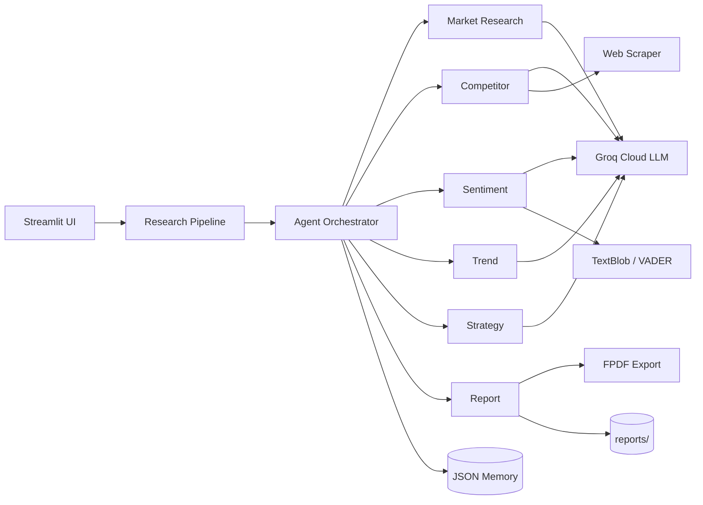

# MarketMind AI

**Multi-Agent Marketing Research & Competitive Intelligence Platform**

MarketMind AI simulates how real marketing intelligence teams collaborate—using specialized AI agents powered by **Groq** (fast cloud LLMs), a modern **Streamlit** dashboard, and lightweight orchestration inspired by LangChain/CrewAI patterns.

> Built for final-year college projects: industry-style architecture, runs on any laptop with internet, no local GPU required.

---

## Features

| Capability | Description |
|------------|-------------|
| **Multi-Agent Pipeline** | 6 specialized agents execute in sequence and share context |
| **Market Research** | Industry, audience, opportunities, market gaps |
| **Competitor Intelligence** | Comparisons, pricing, battle cards |
| **Sentiment Analysis** | TextBlob + VADER on reviews (sample or uploaded CSV) |
| **Trend Forecasting** | Emerging trends and 6–12 month outlook |
| **Marketing Strategy** | Campaigns, positioning, channel plans |
| **SWOT Analysis** | Structured strengths/weaknesses/opportunities/threats |
| **Report Export** | TXT + PDF intelligence reports |
| **Local Memory** | JSON history for research, agents, and chat |
| **Web Scraping** | Public news/competitor pages (graceful offline fallback) |
| **Professional UI** | Dark SaaS-style dashboard with Plotly analytics |

---

## Architecture



**Design principles**

- **Modular agents** — each agent extends `BaseAgent` with a single responsibility
- **Shared context dict** — outputs flow to the next agent (CrewAI-style handoff)
- **Offline resilience** — template fallbacks when Groq API is unavailable
- **Local-only storage** — JSON, CSV, TXT, PDF under project folders

---

## Folder Structure

```
Multi-Agent/
├── app.py                      # Streamlit entry point
├── config.py                   # Paths, Groq API, logging config
├── requirements.txt
├── .env.example                # Copy to .env and add your API key
├── README.md
│
├── agents/                     # Specialized AI agents
│   ├── base_agent.py
│   ├── market_research_agent.py
│   ├── competitor_agent.py
│   ├── sentiment_agent.py
│   ├── trend_agent.py
│   ├── strategy_agent.py
│   └── report_agent.py
│
├── tools/                      # Reusable utilities
│   ├── groq_client.py
│   ├── web_scraper.py
│   ├── analytics.py
│   ├── summarizer.py
│   ├── file_handler.py
│   └── pdf_export.py
│
├── workflows/
│   ├── orchestration.py        # Multi-agent coordinator
│   └── research_pipeline.py    # UI-facing pipeline API
│
├── ui/
│   ├── theme.py
│   ├── sidebar.py
│   ├── dashboard.py
│   ├── workspace.py
│   ├── monitor.py
│   ├── analytics_page.py
│   ├── charts.py
│   └── reports_page.py
│
├── data/                       # Sample CSV/JSON
├── reports/                    # Generated reports
├── logs/                       # execution, agent, error logs
├── uploads/                    # User uploads
└── memory/                     # JSON research & agent memory
```

---

## Setup & Run Guide

### Prerequisites

- **Python 3.10+** installed
- **Internet connection** (for Groq API and optional web scraping)
- A free **Groq API key** from [console.groq.com](https://console.groq.com)

### Step 1 — Get a Groq API key

1. Sign up at [https://console.groq.com](https://console.groq.com)
2. Go to **API Keys** → **Create API Key**
3. Copy the key (starts with `gsk_...`)

### Step 2 — Open the project folder

```powershell
cd f:\Multi-Agent
```

*(Use your actual path if different.)*

### Step 3 — Create a virtual environment (recommended)

```powershell
python -m venv venv
venv\Scripts\activate
```

On macOS/Linux:

```bash
source venv/bin/activate
```

### Step 4 — Install dependencies

```powershell
pip install -r requirements.txt
python -m textblob.download_corpora
```

### Step 5 — Configure the API key

Copy the example env file and paste your key:

```powershell
copy .env.example .env
```

Edit `.env` in any text editor:

```env
GROQ_API_KEY=gsk_your_actual_key_here
```

Optional — change the default model:

```env
GROQ_MODEL=llama-3.1-8b-instant
```

**Alternative:** set the environment variable instead of `.env`:

```powershell
$env:GROQ_API_KEY="gsk_your_actual_key_here"
```

### Step 6 — Launch MarketMind AI

```powershell
streamlit run app.py
```

Open the URL shown in the terminal (usually **http://localhost:8501**).

### Step 7 — Verify in the app

1. In the **sidebar**, confirm **Groq API: Configured** (green)
2. Optionally click **Test Groq connection**
3. Choose an **LLM Model** (default: `llama-3.3-70b-versatile`)

---

## Quick Start (Demo)

1. Open **Research Workspace**
2. Enter:
   - **Business:** EcoSip Smart Bottle
   - **Industry:** Consumer Health Tech
   - **Audience:** Health-conscious millennials
   - **Competitors:** Hydro Flask, Yeti, Stanley
3. Click **Start Full Research**
4. Watch progress in **Agent Monitor**
5. View charts in **Analytics**
6. Download TXT/PDF in **Report Viewer**

Sample reviews are in `data/sample_reviews.csv` (used automatically if you do not upload a CSV).

---

## Groq models

| Model | Best for |
|-------|----------|
| `llama-3.3-70b-versatile` | Highest quality reports (default) |
| `llama-3.1-8b-instant` | Faster, lighter runs |
| `mixtral-8x7b-32768` | Long context |
| `gemma2-9b-it` | Alternative style |

Select any of these in the sidebar **LLM Model** dropdown.

---

## Final Report Sections

Each full research run produces:

1. Executive Summary  
2. Market Overview  
3. Competitor Analysis  
4. Customer Sentiment  
5. SWOT Analysis  
6. Trend Forecast  
7. Marketing Strategy  
8. Recommendations  
9. Future Opportunities  
10. Competitor Battle Card (appendix)

---

## Screenshots

> Add screenshots after running the app for your report/viva.

| Page | Placeholder |
|------|-------------|
| Dashboard | `docs/screenshots/dashboard.png` |
| Research Workspace | `docs/screenshots/workspace.png` |
| Agent Monitor | `docs/screenshots/monitor.png` |
| Analytics | `docs/screenshots/analytics.png` |
| Report Viewer | `docs/screenshots/reports.png` |

---

## Troubleshooting

| Issue | Solution |
|-------|----------|
| Groq not configured | Create `.env` with `GROQ_API_KEY=gsk_...` and restart Streamlit |
| Invalid API key | Regenerate key at [console.groq.com/keys](https://console.groq.com/keys) |
| Rate limit / 429 | Wait a minute or switch to `llama-3.1-8b-instant` |
| Offline template reports | API key missing or wrong — check sidebar status |
| Scraping empty | Normal offline—agents use LLM + fallbacks |
| PDF missing | Check `reports/` folder; re-run research |
| TextBlob errors | Run `python -m textblob.download_corpora` |
| `groq` import error | Run `pip install groq python-dotenv` |

Logs: `logs/execution_logs.txt`, `logs/agent_logs.txt`, `logs/errors.txt`

---

## Viva Talking Points

- **Why multi-agent?** Mirrors real marketing teams—specialists collaborate with handoffs  
- **Why Groq?** Free tier, fast inference, no local GPU—works on low-spec laptops  
- **Orchestration** — sequential pipeline with shared context (CrewAI-inspired, custom lightweight code)  
- **Sentiment** — dual validation with VADER (social text) and TextBlob (polarity)  
- **Storage** — JSON memory, no cloud DB—easy to explain and audit  

---

## Future Enhancements

- [ ] Parallel agent execution for faster runs  
- [ ] RAG over uploaded PDFs (local embeddings)  
- [ ] Scheduled research jobs  
- [ ] Email report delivery (local SMTP)  
- [ ] Custom agent personas via UI  
- [ ] Export to PowerPoint  
- [ ] SQLite cache for large scrape histories  

---

## Tech Stack

Python · Streamlit · Groq API (Llama 3.3 / Mixtral / Gemma) · Pandas · Plotly · BeautifulSoup · Requests · TextBlob · VADER · FPDF2

---

## License

Educational / academic use. Groq API subject to [Groq terms](https://groq.com/terms/).

**MarketMind AI** — *Think like a marketing team. Powered by Groq.*
